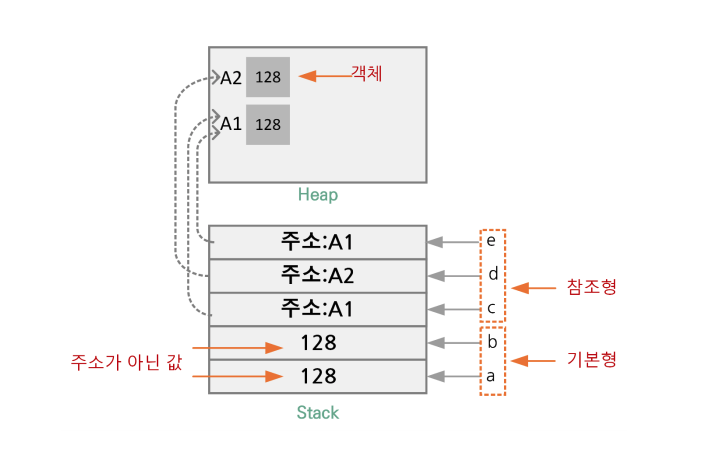

# Kotlin의 변수, 자료형, 기본 연산자

## 변수

### val과 var

* Kotlin에는 두가지 종류의 변수가 있다
  * val (value) -> 값을 변경할 수 없는 변수 (immutable)
  * var (variable) -> 값을 변경할 수 있는 변수 (mutable)

* 변수는 ```<변수 종류> <변수명>: <자료형> = <초기화 값>``` 으로 선언한다

    ```Kotlin
    fun main() {

        val name: String = "SeungHyun Lee"
        var age: Int = 24

        age = 25 // var로 선언한 변수는 값을 변경할 수 있다

        println("name = ${name}, age = ${age}")

    }
    ```

    위 코드의 결과는 다음과 같다

    ```
    name = SeungHyun Lee, age = 25
    ```

* 변수 선언 시 초기화를 했으면 컴파일 과정에서 해당 변수의 자료형을 유추해 낼 수 있기 떄문에 자료형을 생략하고 선언할 수 있다

    ```Kotlin
    fun main() {

        val name = "SeungHyun Lee" // 선언과 동시에 초기화를 하는 경우 자료형을 생략할 수 있다
        var age = 25

        println("name = ${name}, age = ${age}")

    }
    ```

    위 코드의 결과는 다음과 같다

    ```
    name = SeungHyun Lee, age = 25
    ```

* 변수명 명명 규칙은 Java와 동일하다  

### null

* Kotlin의 변수는 기본적으로 null을 허용하지 않음
* Null Pointer Exception이 일어나지 않도록 compile time에 check한다

    ```Kotlin
    fun main() {

        val name: String

        name = null // 여기서 컴파일 에러 발생

        println("name = ${name}")

    }
    ```

    위 코드의 결과는 다음과 같다

    ```
    Kotlin: Null can not be a value of a non-null type String
    ```

* ```<변수 종류> <변수명>: <자료형>?``` 으로 nullable 변수를 선언할 수 있다

    ```Kotlin
    fun main() {

        val name: String?

        name = null

        println("name = ${name}")

    }
    ```

    위 코드의 결과는 다음과 같다

    ```
    name = null
    ```

* nullable 변수를 다음과 같이 사용하면 에러가 발생한다

    ```Kotlin
    fun main() {

        val name: String?

        name = null

        println("name = ${name}, length = ${name.length}") // nullable 변수인 name의 attribute에 그냥 접근하는 것을 compile time에 차단한다

    }
    ```

    위 코드의 결과는 다음과 같다

    ```
    Kotlin: Only safe (?.) or non-null asserted (!!.) calls are allowed on a nullable receiver of type String?
    ```

* nullable 변수에는 다음과 같이 ```?.```(safe call) 연산자로 접근할 수 있다

    ```Kotlin
    fun main() {

        var name: String?

        name = null
        println("name = ${name}, length = ${name?.length}") // name이 null이면 ?.의 결과는 null

        name = "Peter"
        println("name = ${name}, length = ${name?.length}") // name이 null이 아니면 해당 attribute에 접근한다

    }
    ```

    위 코드의 결과는 다음과 같다

    ```
    name = null, length = null
    name = Peter, length = 5
    ```

이와 같이 Kotlin은 nullable 변수가 null이 아닐 때에만 안전하게 접근하는 방법을 제공한다

* ```!!``` (not null assertion) operator
  * Kotlin은 null pointer exception을 좋아하는(?) 사람들을 위해 ```!!``` 연산자를 만들어 놨다
  * ```!!``` 연산자를 이용하면 nullable 변수가 항상 null이 아닐 것이라고 가정하고 접근한다

  ```Kotlin
  fun main() {

      var name: String?

      name = null
      println("name = ${name}, length = ${name!!.length}") // length에 접근할 때 null pointer exception 발생

  }
  ```

    위 코드의 결과는 다음과 같다

  ```
  Exception in thread "main" kotlin.KotlinNullPointerException
  ```

    당연히 ```!!``` 연산자는 사용하지 않는것이 좋다

* ```?:``` (Elvis) 연산자
  * 연산자 모양이 엘비스 프레슬리를 연상시켜 Elvis 연산자라는 이름이 붙었다
  * 변수가 null이 아니면 그 값을 사용하고, null이면 따로 지정된 값을 사용한다

  ```Kotlin
  fun main() {

      var name: String?

      name = null
      var len = name?.length ?: 0 // name이 null이면 ?: 뒤의 값
      println("name = ${name}, length = ${len}")

      name = "Peter"
      len = name?.length ?: 0 // name이 null이 아니면 name.length
      println("name = ${name}, length = ${len}")

  }
  ```

  위 코드의 결과는 다음과 같다

  ```
  name = null, length = 0
  name = Peter, length = 5
  ```

## 자료형

* Kotlin의 기본 자료형은 다음과 같다

    |Type|Size (Byte)|
    |-|-|
    |Byte|8|
    |Short|16|
    |Int|32|
    |Long|64|
    |Float|32|
    |Double|64|
    |Boolean|1 (bit)|
    |Char|2|
    |String||
    |Array||
    |UByte|8|
    |UShort|16|
    |UInt|32|
    |ULong|64|

* Java와 달리 Kotlin에는 primitive 자료형이 없다
* 모든 자료형은 reference type으로 객체로 취급된다

```Kotlin
fun main() {

    val num = 3.times(4) // 모든 자료형은 객체처럼 취급된다
    println(num)

}
```

위 코드의 결과는 다음과 같다

```
7
```

* 하지만 컴파일 과정에서 성능 향상을 위해 primitive type으로 변환된다
* 문자열 상수는 heap 메모리 영역의 string pool 영역에 잡히게 된다
* 문자열 상수는 immutable. 문자열 수정 시 새로운 문자열이 메모리에 잡힌다.

### 형변환

* Kotlin에서는 자료형이 다른 변수에 값을 재할당 하면 자동 형변환이 되지 않는다

    ```Kotlin
    fun main() {

        val dNum: Int = 3
        val fNum: Float = dNum // Float type 변수를 Int형 변수로 초기화하면 컴파일 에러 발생
        
        println(fNum)

    }
    ```

    위 코드의 결과는 다음과 같다

    ```
    Kotlin: Type mismatch: inferred type is Int but Float was expected
    ```

* 다음과 같이 다른 타입의 literal을 이용해 초기화 시에도 컴파일 에러가 발생한다

    ```Kotlin
    fun main() {

        val fNum: Float = 3 // Float type 변수를 Int literal을 이용해 초기화하면 컴파일 에러 발생

        println(fNum)

    }
    ```

    위 코드의 결과는 다음과 같다

    ```
    Kotlin: The integer literal does not conform to the expected type Float
    ```

* 다음과 같이 변환 메서드를 이용해 명시적 형변환을 해줘야 한다

    ```Kotlin
    fun main() {

            val dNum: Int = 3
            val fNum: Float = dNum.toFloat()
            
            println(fNum)

    }
    ```

    위 코드의 결과는 다음과 같다

    ```
    3.0
    ```

* 다음과 같이 연산을 하는 경우에는 자동 형변환이 일어난다

    ```Kotlin
    fun main() {

        println(98765432109L + 3)

    }
    ```

    위 코드의 결과는 다음과 같다

    ```
    98765432112
    ```

### Number 자료형

* Number는 Kotlin의 모든 numeric 자료형들의 부모 클래스이다
* Number class를 이용하면 smart casting으로 숫자 자료형들간에 암시적 형변환이 가능하다

    ```Kotlin
    fun main() {

        var number: Number = 3.14
        println(number)

        number = 3
        println(number)

        number = 98765432111L
        println(number)


        number = 3f
        println(number)

    }
    ```

    위 코드의 결과는 다음과 같다

    ```
    3.14
    3
    98765432111
    3.0
    ```

* ```is``` 키워드를 이용해 현재 data의 type을 확인할 수 있다


    ```Kotlin
    fun main() {

        fun main() {

            val number: Number = 3.14

            if (number is Int) {
                println("The type of number is Int")
            } else {
                println("The type of number is not Int")
            }

        }

    }
    ```

    위 코드의 결과는 다음과 같다

    ```
    The type of number is not Int
    ```

### Any class 

* ```Any``` class는 Kotlin의 모든 class들의 부모 class이다

## 기본 연산자

### 비교 연산자

* 이중 등호 (```==```)와 삼중 등호 (```===```)
  * 이중 등호 (```==```) -> 값만 비교할 때 사용
  * 삼중 등호 (```===```) -> 값과 참조를 비교할 때 사용 (Java의 "=="가 이것)


  ```Kotlin
  fun main() {

      val a: Int = 128
      val b: Int = a

      val c: Int? = a
      val d: Int? = a
      val e: Int? = c

      println(a === b) // true
      println(a == c) // true
      println(a === c) // false
      println(c === d) // false
      println(c === e) // true

  }
  ```

    
    출처 : https://www.boostcourse.org/mo132/lecture/59969/

  * ```println(a === b) // true```  
    Int type은 컴파일 시 primitive type으로 변환된다  
    변환 후에는 주소가 아닌 값이 되므로 ```==``` 연산 시 true가 된다
  * ```println(a == c) // true```
    a와 c에 들어있는 값은 128로 동일하므로, 값만 check하는 ```==``` 연산 시 true가 된다
  * ```println(a === c) // false```
    a는 값이지만 c는 ```Int?``` 객체이므로 a와 다름
  * ```println(c === d) // false```
    d는 c는 a를 통해 생성된 서로 다른 ```Int?``` 객체이므로 다르다
  * ```println(c === e) // true```
    e는 ```Int?``` 객체인 c를 통해 생성된 변수이므로 같은 곳을 참조하고 있다
    